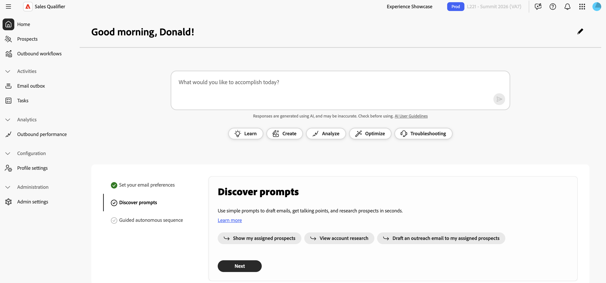

# Sales Qualifier入门

Adobe为您的组织配置Sales Qualifier后，[!DNL Marketo]系统管理员必须创建所需的用户组并连接Salesforce或Microsoft Dynamics 365。

{width="800" zoomable="yes"}

## 设置用户组

Adobe Admin Console中的用户组可用于控制对Sales Qualifier的访问。 必须先创建这两个组，用户才能登录。

有关设置群组的信息，请参阅[Adobe Admin Console文档](https://helpx.adobe.com/business/enterprise/users/users-and-groups/user-groups.html)。

>[!PREREQUISITES]
>
>创建组的管理员必须满足以下两个要求：
>
>* 成为组织管理员，可从Adobe应用程序切换器访问&#x200B;**[!UICONTROL Admin Console]**。
>* 已分配Adobe Experience Platform产品或成为系统管理员。 否则，Adobe Experience Platform将不会显示在产品列表中。

### Sales Qualifier用户

用户必须属于`Sales Qualifier`用户组才能访问该应用程序。

这些步骤可在Adobe Admin Console中完成。

1. 从应用程序切换器中，选择&#x200B;**[!UICONTROL Admin Console]**。
1. 选择&#x200B;**[!UICONTROL 用户]** > **[!UICONTROL 用户组]** > **[!UICONTROL 新用户组]**。
1. 输入`Sales Qualifier`作为组名，然后选择&#x200B;**[!UICONTROL 保存]**。
1. 打开&#x200B;**[!UICONTROL 已分配的产品配置文件]**&#x200B;并选择&#x200B;**[!UICONTROL 分配配置文件]**。
1. 选择&#x200B;**[!UICONTROL Adobe Experience Platform]**。
1. 选择&#x200B;**[!UICONTROL 默认的生产所有访问]**&#x200B;产品配置文件，选择&#x200B;**[!UICONTROL 应用]**，然后选择&#x200B;**[!UICONTROL 保存]**。
1. 打开&#x200B;**[!UICONTROL 用户]**&#x200B;并选择&#x200B;**[!UICONTROL 添加用户]**&#x200B;以添加需要访问Sales Qualifier的所有人。

### Sales Qualifier管理员

配置CRM连接、[知识中心](admin-settings.md#knowledge-center)和全局电子邮件选择退出设置的管理员也必须属于`Sales Qualifier Admins`用户组。

1. 在Adobe Admin Console中，选择&#x200B;**[!UICONTROL 用户]** > **[!UICONTROL 用户组]** > **[!UICONTROL 新用户组]**。
1. 输入`Sales Qualifier Admins`作为组名，然后选择&#x200B;**[!UICONTROL 保存]**。
1. 打开&#x200B;**[!UICONTROL 用户]**，选择&#x200B;**[!UICONTROL 添加用户]**，然后添加管理员。
1. 确认每个管理员也是`Sales Qualifier`组的成员。

两个群组的成员身份使&#x200B;**[!UICONTROL 管理员设置]**&#x200B;在左侧导航栏的&#x200B;**[!UICONTROL 管理]**&#x200B;下可见。 标准用户使用管理员配置的字段、过滤器和剧本。 配置的选择退出页脚自动应用于其出站电子邮件。 标准用户无法更改这些设置。

用户组名必须与上一步骤中所示完全匹配。

您还可以创建可选的`Sales Qualifier BDR managers`组。 此组的成员可以访问电子邮件性能报表。

## 连接您的CRM

Sales Qualifier可连接到Salesforce或Microsoft Dynamics 365，从而为BDR提供用户、潜在客户、联系人、客户、机会、所有者映射和相关活动的统一视图。 初始连接需要此CRM数据的只读访问权限。 要在连接Sales Qualifier之前准备凭据，请与您的CRM管理员联系。 有关集成详细信息，请参阅[集成](integrations.md)。

>[!PREREQUISITES]
>
>要访问CRM管理界面，您必须属于`Sales Qualifier Admins` Adobe Admin Console组和`Sales Qualifier`组。

>[!BEGINTABS]

>[!TAB Salesforce]

Salesforce系统管理员创建外部客户端应用程序（也称为连接的应用程序）并配置其运行方式用户。

>[!PREREQUISITES]
>
>确认Salesforce管理员具有以下权限：
>
>* 自定义应用程序
>* 查看设置和配置
>* 修改所有数据
>* 管理连接的应用程序
>
>管理员需要&#x200B;_管理连接的应用程序_&#x200B;才能查看客户端ID和客户端密钥。

1. 在Salesforce中，转到&#x200B;**[!UICONTROL 设置]** > **[!UICONTROL 应用程序管理器]**&#x200B;并选择&#x200B;**[!UICONTROL 新连接的应用程序]**&#x200B;或&#x200B;**[!UICONTROL 新外部客户端应用程序]**。
1. 输入应用程序名称和管理联系人电子邮件。
1. 启用OAuth并输入回调URL。

   如果连接不使用重定向，请输入任何有效的URL。

1. 添加以下OAuth范围：

   * 访问身份URL服务(`id`， `profile`， `email`， `address`， `phone`)
   * 通过API (`api`)管理用户数据
   * 访问唯一的用户标识符(`openid`)

1. 启用客户端凭据流并选择一个&#x200B;**[!UICONTROL 运行身份]**&#x200B;用户。
1. 确认运行方式用户具有`Leads`、`Accounts`、`Contacts`、`Tasks`、`Events`、`Opportunity`、`OpportunityContactRoles`和`OpportunityLineItems`的&#x200B;**读取**&#x200B;访问权限。 同时确认已启用&#x200B;**访问活动**。
1. 保存应用程序。
1. 从&#x200B;**[!UICONTROL 应用程序管理器]**&#x200B;中，打开应用程序并选择&#x200B;**[!UICONTROL 查看]** > **[!UICONTROL 使用者详细信息]**。
1. 为Sales Qualifier连接复制以下值：

   * 使用者密钥（客户端ID）
   * 使用者密码（客户端密码）
   * 回调 URL
   * Salesforce实例URL

步骤与此处描述的步骤略有不同。 有关详细信息，请参阅[Salesforce文档](https://help.salesforce.com/s/?language=en_US)。

### 查找您的Salesforce实例URL

1. 从浏览器地址栏登录并记下您的组织&#x200B;_我的域_&#x200B;子域（`{{mydomain}}`值）。
1. 对Sales Qualifier使用规范格式： `https://{{mydomain}}.my.salesforce.com`。

请勿使用`lightning.force.com` URL作为实例URL。

>[!TIP]
>
>如果CRM连接界面报告缺少作用域，请检查&#x200B;**[!UICONTROL 标准对象权限]**&#x200B;下的运行方式用户配置文件，以获取&#x200B;**读取**&#x200B;潜在客户、联系人、帐户和机会的访问权限。 同时检查每个分配的权限集中的&#x200B;**[!UICONTROL 对象设置]**。

>[!TAB Microsoft Dynamics 365]

Microsoft Dynamics 365或Azure管理员可注册应用程序并将其添加到Dynamics环境。

1. 在Microsoft Entra ID中，选择&#x200B;**[!UICONTROL 应用程序注册]**&#x200B;并注册应用程序。
1. 复制客户端ID和租户ID，并创建客户端密码。
1. 在&#x200B;**[!UICONTROL Power Platform管理中心]**&#x200B;中，选择&#x200B;**[!UICONTROL 环境]**&#x200B;并打开Dynamics环境。
1. 转到&#x200B;**[!UICONTROL 设置]** > **[!UICONTROL 用户+权限]** > **[!UICONTROL 应用程序用户]**，然后选择&#x200B;**[!UICONTROL 新应用程序用户]**。
1. 选择已注册的Microsoft Entra应用程序。
1. 分配一个授予对销售线索、联系人、帐户、业务机会和活动的读取权限的安全角色。

   需要安全角色。 应用程序需要安全角色才能访问Dynamics数据。

1. 收集客户端ID、客户端密钥、租户ID和Dynamics实例URL。 使用规范URL表单`https://{{mydomain}}.crm.dynamics.com`。

>[!ENDTABS]

### 输入您的连接

1. 作为两个必需的Sales Qualifier组的成员，登录到Sales Qualifier并确认选择了正确的沙盒或环境。
1. 在左侧导航中，展开&#x200B;**[!UICONTROL 管理]**，然后选择&#x200B;**[!UICONTROL 管理设置]**。
1. 选择&#x200B;**[!UICONTROL 集成]**&#x200B;下的&#x200B;**[!UICONTROL CRM连接]**。

   页面会显示Salesforce和Microsoft Dynamics的信息卡。 非活动连接显示&#x200B;**[!UICONTROL 连接]**。 已配置的连接显示&#x200B;**[!UICONTROL 已连接]**&#x200B;和&#x200B;**[!UICONTROL 管理]**。

   {width="800" zoomable="yes"}

1. 为您使用的CRM选择&#x200B;**[!UICONTROL 连接]**。
1. 输入CRM管理员提供的凭据和实例URL。
1. 成功连接后，确认卡片显示&#x200B;**[!UICONTROL 已连接]**。

### 导入CRM字段

连接CRM后，配置入站映射以确定哪些CRM字段显示在Sales Qualifier中。 在连接的CRM信息卡上，选择&#x200B;**[!UICONTROL 管理]**&#x200B;以打开&#x200B;**[!UICONTROL 入站映射]**，然后为要导入其字段的每个实体类型添加一个节。

请参阅[映射CRM字段（入站映射）](integrations.md#map-crm-fields-inbound-mapping)以了解完整的步骤，包括如何使导入的字段可用作筛选条件。

## 后续步骤

>[!MORELIKETHIS]
>
>* [潜在客户](prospects.md)
>* [出站工作流](outbound-workflows.md)
