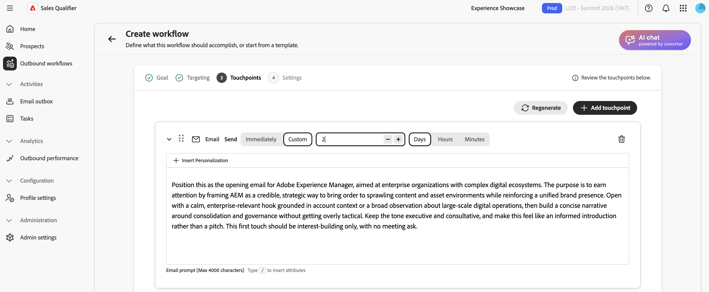

# 出站工作流

叫客工作流是目标驱动的外联频率。 您可以定义目标和定位标准。 然后，AI提出一种多点触控节奏，并为每个潜在客户编写个性化的电子邮件内容。 在激活节奏之前，请查看并批准每封电子邮件。

出站工作流连接四个元素：

* **目标** — 您希望从外展中获得的结果，如预订发现电话或增加活动注册。
* **定位过滤器** — 确定哪些潜在客户符合条件的条件。
* **接触点节奏** — 电子邮件、电话和LinkedInMail步骤的顺序顺序。
* **个性化电子邮件内容** — 基于潜在客户个人资料、帐户上下文、参与历史记录和最近新闻的AI生成的内容。

AI使用目标来建议定位过滤器、设计节奏、草稿接触点提示并个性化每个生成的电子邮件。

## 重要概念

| 概念 | 描述 |
| --- | --- |
| **出站工作流** | 由目标、定向过滤器、节奏和设置定义的可重用出站活动。 |
| **目标** | 外联工作应该取得什么成果。 |
| **接触点** | 按计划相对于注册步调执行一步（电子邮件、电话或链接In Mail）。 |
| **接触点提示** | 在生成潜在客户的电子邮件主题行和正文时，AI将遵循相关说明，包括语调、时长、焦点和call to action。 |
| **节奏** | 接触点的完整序列：数量、顺序以及日期。 |
| **定位筛选器** | 将叫客工作流限制为潜在客户子集的条件。 |
| **草稿** | 已生成准备好进行审查但尚未批准的电子邮件。 |
| **推理** | AI对如何写一封给定电子邮件的解释，包括它使用的信号和数据源。 |
| **注册** | 批准目标客户的草稿，这将激活节奏并将要在出站工作流发送窗口期间发送的电子邮件排入队列。 |

以下部分将介绍如何创建出站工作流、审查生成的电子邮件、批准潜在客户和管理出站工作流。

## 创建出站工作流

出站工作流向导包含五个步骤：**[!UICONTROL 目标]**、**[!UICONTROL 定位]**、**[!UICONTROL 生成接触点]**、**[!UICONTROL 设置]**&#x200B;和&#x200B;**[!UICONTROL 添加潜在客户]**。 您的目标决定了剩余的步骤。

1. 在左侧导航中，选择&#x200B;**[!UICONTROL 出站工作流]**。
1. 在&#x200B;**[!UICONTROL 浏览]**&#x200B;选项卡的右上角选择&#x200B;**[!UICONTROL +创建出站工作流]**。

### 步骤1：定义目标

目标定义预期结果并指导定位、节奏和电子邮件生成。

1. 选择&#x200B;**[!UICONTROL 从头开始]**&#x200B;以编写您自己的目标，或选择&#x200B;**[!UICONTROL 从模板开始]**&#x200B;以使用已保存的模板。

1. 选择与您的公司匹配的&#x200B;**[!UICONTROL 推荐目标]**&#x200B;之一。 每条建议都包括对它适合的理由的简短解释。 选择要填写目标的推荐，选择&#x200B;**[!UICONTROL 查看全部]**&#x200B;以浏览完整的推荐集，或输入您自己的目标。 您还可以从&#x200B;**[!UICONTROL 热门目标]**&#x200B;列表中选择。
1. 选择&#x200B;**[!UICONTROL 下一步：定位]**。

在目标中说明具体结果。 例如，输入`Book a 15-minute discovery call with marketing leaders evaluating campaign automation`而不是`Promote campaign automation`。

### 步骤2：配置定位过滤器

定位过滤器定义哪些潜在客户符合条件。 当您稍后添加潜在客户时，只有符合这些过滤器的潜在客户才会显示在选择列表中。

{width="800" zoomable="yes"}

1. 选择向下箭头以打开&#x200B;**[!UICONTROL 添加筛选器]**&#x200B;列表，然后选择筛选器。

1. 设置筛选器的值。
1. 如果需要缩小受众，请添加更多过滤器。

1. 选择&#x200B;**[!UICONTROL 下一步：生成接触点]**。

### 步骤3：生成并查看接触点

配置定位后，AI会分析目标和定位标准、定义节奏并为每个接触点编写提示。 节奏可以包括电子邮件、电话和LinkedIn InMail步骤。

{width="800" zoomable="yes"}

展开电子邮件接触点以读取其提示。 提示将指导AI编写每个潜在客户的电子邮件，包括语气、时长、焦点和call to action。

键入正斜杠`/`可显示可用于个性化电子邮件的已定义令牌列表。

#### 重新生成节奏

如果节奏不是您想要的，请选择&#x200B;**[!UICONTROL 重新生成]**&#x200B;并输入精简指令。 例如：

* `Use three touchpoints across two weeks`
* `Lead with an executive briefing offer in the first email`
* `Add a nurture touch focused on a relevant case study`

AI会根据您的指令重写整个节奏。 要调整一个电子邮件接触点，请编辑其提示而不是重新生成整个节奏。

设置接触点延迟，以天、小时和分钟为单位。 将天数、小时数和分钟数设置为`0`以发送接触点，而不等待注册或完成上一个接触点。 使用较长的延迟隔开节奏中稍后的接触点。

#### 在提示中使用知识中心

如果贵组织已构建了[知识中心](knowledge-center.md)行动手册，请在提示中参阅该行动手册。 命名文档并描述要使用的上下文。 例如，输入`Use the ABC positioning guide from the Knowledge Center and focus on the security value proposition`。

当节奏和提示就绪时，选择&#x200B;**[!UICONTROL 下一步：设置]**。

在生成潜在客户电子邮件之前，优化接触点提示。 AI会为每个选定的潜在客户使用这些提示。

### 步骤4：配置出站工作流设置

**[!UICONTROL 设置]**&#x200B;步骤控制出站工作流的运行方式。

{width="800" zoomable="yes"}

1. 查看&#x200B;**[!UICONTROL 出站工作流名称]**，并根据需要更改它。
1. 在&#x200B;**[!UICONTROL 每个出站工作流的最大潜在客户数]**&#x200B;中，确认出站工作流一次可以管理的最大潜在客户数。
1. 设置&#x200B;**[!UICONTROL 发送窗口]**&#x200B;为允许发送出站电子邮件的小时数。
1. 选择在一周中可以发送电子邮件的日期。 为避免周末发送，请仅选择工作日，而不使用单独的&#x200B;**[!UICONTROL 跳过周末]**&#x200B;设置。
1. 选择是否在每个目标客户最活跃的时段发送。
1. 若要在潜在客户预订会议后自动停止跟进接触点，请打开&#x200B;**[!UICONTROL 会议预订暂停]**。
1. 选择使用每个潜在客户的时区还是出站工作流&#x200B;**[!UICONTROL 时区]**&#x200B;进行发送计时。 如果使用出站工作流时区，请确认它与受众匹配。
1. 在&#x200B;**[!UICONTROL 权限]**&#x200B;下，保留&#x200B;**[!UICONTROL 私有]**（默认）或选择&#x200B;**[!UICONTROL 与所有人共享]**。 有关详细信息，请参阅[共享出站工作流](#share-an-outbound-workflow)。
1. 选择&#x200B;**[!UICONTROL 保存并添加潜在客户]**。

选择退出页脚由管理员全局配置，并独立于出站工作流设置应用于出站电子邮件。 请参阅[配置全局电子邮件选择退出](integrations.md#configure-global-email-opt-out)。

### 步骤5：添加潜在客户并开始生成电子邮件

保存将打开应用了步骤2中的定位过滤器的目标客户选择视图。

1. 查看列表。

   行通常包括潜在客户名称、帐户、电子邮件、职务、参与状态和潜在客户状态。

1. 如果需要展开或缩小列表，请在此处调整筛选器。
1. 使用复选框选择潜在客户。
1. 选择&#x200B;**[!UICONTROL 下一步：查看接触点]**&#x200B;以开始为每个潜在客户生成电子邮件。

AI会为每个选定的潜在客户生成个性化电子邮件，并发送电子邮件到接触点。 Phone和LinkedIn InMail接触点仍保留计划的步骤。 要在生成期间继续工作，请选择&#x200B;**[!UICONTROL 准备就绪时通知]**。

对于每个潜在客户，AI将接触点提示与人员和帐户数据、参与历史记录和最新消息组合在一起，以产生主题行和正文。

## 查看和优化生成的电子邮件

生成完成后，“出站工作流”详细信息视图将提示您查看草稿。 在您批准之前，Sales Qualifier不会发送电子邮件。

1. 在“出站工作流”详细信息视图中，选择横幅中的&#x200B;**[!UICONTROL 审核草稿]**。
1. **[!UICONTROL 查看接触点]**&#x200B;步骤有两个选项卡：
   * **[!UICONTROL 准备好审查]** — 已完成生成的电子邮件。
   * **[!UICONTROL 正在生成]** — 仍在写入电子邮件。
1. 在左侧的目标客户列表中，选择一个名称以在右侧加载该目标客户的接触点。
1. 在接触点上使用V形(**>**)展开并读取完整的主题行和正文。

### 阅读AI推理

对于每个生成的电子邮件，**[!UICONTROL 推理]**&#x200B;说明AI如何创建该消息，包括信号、属性和塑造内容和call to action的源。 在批准之前，请查看此信息并验证个性化。

### 直接编辑电子邮件

对于少量措辞或语调变化：

1. 在展开的接触点上，选择&#x200B;**[!UICONTROL 编辑]**&#x200B;图标以打开编辑器。
1. 编辑主题行或正文。
1. 选择&#x200B;**[!UICONTROL 保存]**。

### 使用AI优化电子邮件

若要进行结构更改或强调更改，请使用&#x200B;**[!UICONTROL 使用AI生成]**。 AI重写电子邮件，同时保留其个性化上下文。

1. 在电子邮件编辑器中，选择&#x200B;**[!UICONTROL 使用AI生成]**。

1. 输入明确的指令，例如：
   * `Make it shorter and more direct. Keep it under 100 words.`
   * `Focus more on the prospect's role and how the solution helps them specifically.`
   * `Change the call-to-action to suggest a 15-minute introductory call instead.`
1. 查看修订版本并根据需要对其进行编辑。
1. 选择&#x200B;**[!UICONTROL 保存]**。

>[!TIP]
>
>使用直接编辑更改措辞和语调。 使用&#x200B;**[!UICONTROL 通过AI生成]**&#x200B;来重写电子邮件。

## 批准和注册潜在客户

审批可激活目标客户的节奏。 在您批准并注册潜在客户之前，系统不会向这些客户发送电子邮件。

1. 在左边的目标客户列表中，选择您审查并准备发送其电子邮件的目标客户。
1. 选择右下角的&#x200B;**[!UICONTROL 批准并注册潜在客户]**。

根据出站工作流的选定日期、发送窗口、活动小时选项和时区设置发送已批准的电子邮件。 零延迟的接触点无需等待即可发送；其他每个接触点都遵循其配置的延迟。 未批准的潜在客户保留在&#x200B;**[!UICONTROL 中可供审查]**。

## 共享出站工作流

每个出站工作流都具有&#x200B;**[!UICONTROL 权限]**&#x200B;设置。 出站工作流默认为&#x200B;**[!UICONTROL 私有]**。 所有者可以选择&#x200B;**[!UICONTROL 与所有人共享]**&#x200B;以使出站工作流可供团队使用。

>[!CAUTION]
>
>共享是永久性的。 将“出站工作流”设置为&#x200B;**[!UICONTROL 与所有人]**&#x200B;共享后，无法将其更改回&#x200B;**[!UICONTROL 私有]**。

在共享的叫客工作流中，队友可以注册自己的潜在客户。 每个人员只能管理或暂停他们注册的潜在客户，包括使用批量操作时。 仅出站工作流所有者可以编辑计划级别的设置，包括计划、时区、节奏和其他设置。 这些设置对于队友是只读的。

使用这些过滤器可重点关注共享的出站工作流和结果：

* 在&#x200B;**[!UICONTROL 参与的潜在客户]**&#x200B;和&#x200B;**[!UICONTROL 绩效]**&#x200B;上，使用&#x200B;**[!UICONTROL 注册者]**&#x200B;筛选潜在客户，筛选注册者为潜在客户。 该过滤器默认为您注册的潜在客户。
* 在&#x200B;**[!UICONTROL 浏览]**&#x200B;选项卡上，使用共享筛选器选择&#x200B;**[!UICONTROL 由我共享]**、**[!UICONTROL 与我共享]**、**[!UICONTROL 私有]**&#x200B;或&#x200B;**[!UICONTROL 全部]**。

## 外出回复处理

当潜在客户回复邮件时，出站工作流会自动处理该邮件。

* **自动恢复**：默认开启。 如果外出回复包括返回日期，则出站工作流会恢复该日期的频率。 如果未提供返回日期，则出站工作流将在您的团队可以配置的恢复后缓冲区后恢复。
* **手动选项**：销售代表仍然可以选择&#x200B;**[!UICONTROL 立即继续]**&#x200B;或安排一个特定的继续日期。 请参阅[管理现有的出站工作流](#manage-existing-outbound-workflows)。

## 管理现有出站工作流

在&#x200B;**[!UICONTROL 出站工作流]**&#x200B;页面上，**[!UICONTROL 浏览]**&#x200B;选项卡列出了您可用的每个出站工作流。 每个信息卡都会显示目标、配置的接触点和性能指标。 使用此视图监视出站工作流、审查草稿或添加潜在客户。

## 电子邮件发件箱

[电子邮件发件箱](email-outbox.md)列出了代表您发送的自动电子邮件和任何回复。

## 会议预订

在连接日历时，Sales Qualifier会生成一个个人预订链接，潜在客户可以使用该链接来安排与您在一起的时间。

* **预订链接** — 在[配置文件设置](profile-settings.md)中配置日历连接和可用性。 将预订链接添加到您的电子邮件签名，使其显示在出站电子邮件中。
* **节奏位置** — Sales Qualifier在相关点以节奏插入您的预订链接。 您可以更改其放置。
* **Booking暂停** — 当潜在客户预订会议时，**[!UICONTROL Meeting Booking暂停]**&#x200B;停止后续跟进。 请参阅[步骤4：配置出站工作流设置](#step-4-configure-outbound-workflow-settings)。

在[出站性能](performance.md)页面上跟踪预订结果。

## 出站工作流最佳实践

* **定义特定目标。** 定位、节奏和电子邮件都源自目标。 指出您希望叫客工作流实现的结果。
* **在每个潜在客户生成之前完成接触点提示。** 在批量生成之后，通常一次只对一个潜在客户进行更改。
* **使用推理作为质量检查。** 如果强调错误的信号或缺少相关信号，请编辑电子邮件或修改接触点提示并重新生成频率。
* **将编辑工具与更改匹配。** 对措辞和语气使用直接编辑。 使用&#x200B;**[!UICONTROL 通过AI]**&#x200B;生成，进行重组或重新组帧。
* **仅批准您审查的内容。** 在注册之前，先展开接触点、阅读内容并在必要时对其进行优化。

>[!MORELIKETHIS]
>
>* [任务](tasks.md)
>* [知识中心](knowledge-center.md)
>* [出站性能](performance.md)
