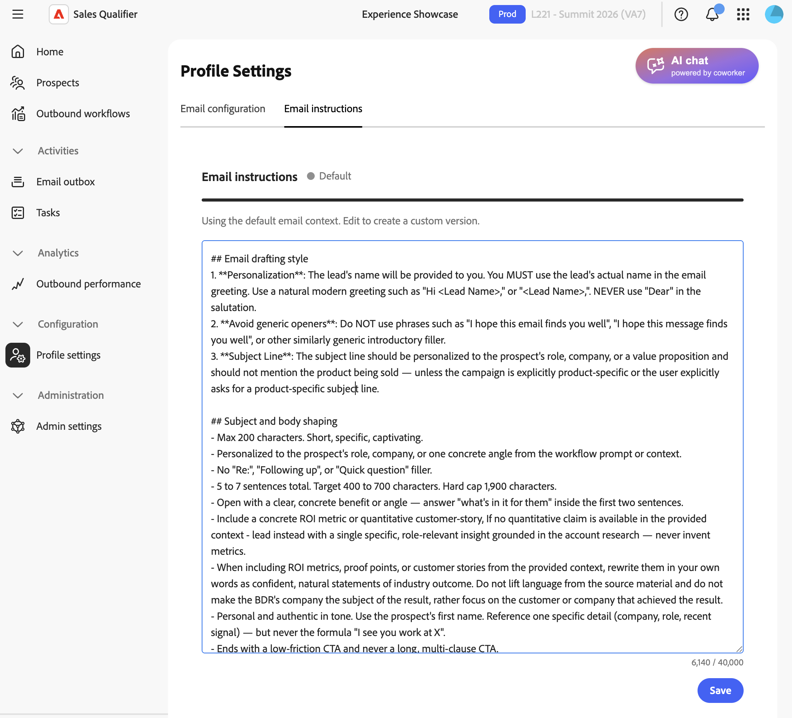

# 轮廓设置

在左侧导航中，展开&#x200B;**[!UICONTROL 配置]**&#x200B;并选择&#x200B;**[!UICONTROL 配置文件设置]**。 使用这些设置管理您的个人详细信息、电子邮件连接、日历和聊天可用性。

## 电子邮件设置

在&#x200B;**[!UICONTROL 电子邮件设置]**&#x200B;选项卡中，设置您的电子邮件连接。

* **[!UICONTROL 电子邮件连接]** — 选择Microsoft Outlook或Google并遵循登录流程。 有关您审批的访问权限和管理员审批路径（如果需要），请参阅[连接Outlook](integrations.md#connect-outlook)。
* **[!UICONTROL 电子邮件签名]** — 添加或更新生成的电子邮件中使用的签名。 包含您的[会议预订](outbound-workflows.md#meeting-booking)链接，以便潜在客户可以安排与您共度的时间。
* **[!UICONTROL 会议预订链接]** — 在电子邮件中发送会议邀请。 采用会议URL。

### 电子邮件起草上下文

使用&#x200B;**[!UICONTROL 电子邮件起草上下文]**&#x200B;来设置电子邮件语调、结构和样式，以使电子邮件保持一致。

在&#x200B;**[!UICONTROL 电子邮件起草上下文]**区域以纯标记形式写入您的上下文。
使用它来定义：

* 音调和声音
* 结构和长度
* Personalization和问候语规则
* 主题行样式
* 如何使用参与信号
* 如何构建量度、证据和客户案例

默认情况下，草稿使用内部样式上下文，因此在添加自己的上下文之前，现有草稿不会更改。

## 日程表配置

在&#x200B;**[!UICONTROL 日历配置]**&#x200B;选项卡上，设置您的时区和可用性。

* **[!UICONTROL 日历连接]** — 选择&#x200B;**[!UICONTROL 连接]**&#x200B;并遵循Microsoft登录流程。
* **[!UICONTROL 会议确认电子邮件]** — 定义目标客户在预订会议后收到的确认电子邮件的主题和正文。
* **[!UICONTROL 首选项]** — 设置默认会议长度和会议之间的缓冲区。

如果断开日历：

* 活动的预订链接停止工作。
* 预订页面显示临时不可用消息。
* 当您重新连接时，您的设置将被保留。

## 日历可用性

您在Adobe Marketo Qualifier中的日历可用性基于两个输入：

* 已连接的工作日历，如Outlook或Gmail
* **[!UICONTROL 日历配置]**&#x200B;中的可用性和时隙规则

Marketo限定符从连接的日历中读取忙/闲状态，而不是事件详细信息。 它将此状态与您的规则相结合，以确定潜在客户可以预订的时段。

您可以配置：

* 按星期几的工作时间
* 每天多个数据块，例如，上午9:00（正午）和下午1:00-5:00
* 您的时区
* 会议时长
* 会议前后缓冲
* 最低通知
* 预订窗口

>[!MORELIKETHIS]
>
>* [出站工作流](outbound-workflows.md)
>* [集成](integrations.md)
>* [任务](tasks.md)
